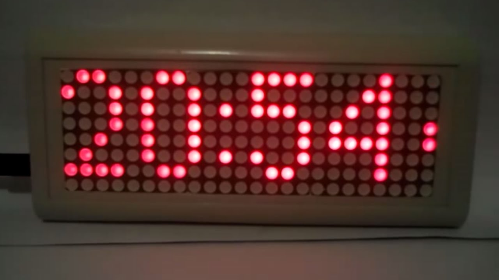
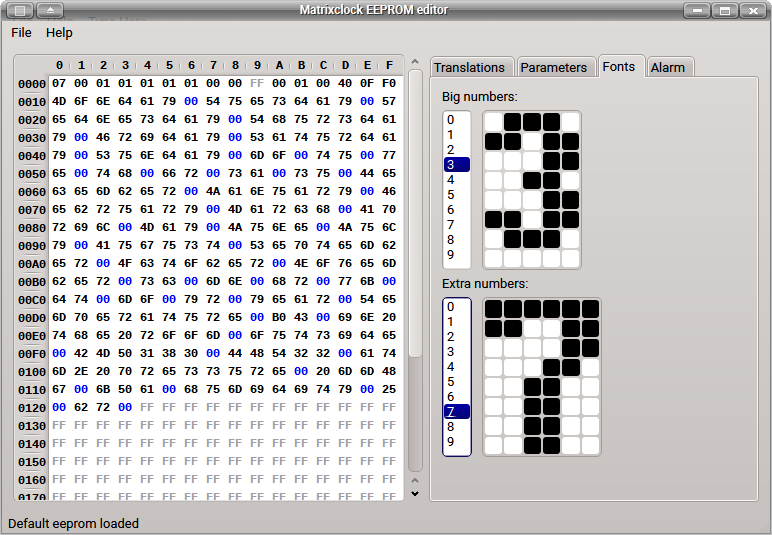

# Matrixclock

This project is a simple LED matrix clock. It can use either MAX7219 as LED drivers (one IC per matrix) either HT1632 LED driver. It's possible to use 3 or 4 matrixes, but recent code is more suitable for second option.

There is a [video](https://youtu.be/mCT93ut2W2s) on Youtube about this.

# Main features:

* RTC DS1307 support (DS3231 also works)
* One alarm which can be enabled for any day of week
* Active beeper is used for alarm and signals
* Temperature measurement with DS18B20 sensors
* Pressure/temperature measurement with BMP180 sensor
* Humidity/temperature measurement with DHT22 sensor
* Scrolling date and sensors data strings
* Reducing brigtness in darkness

# Supported LED drivers:

* MAX7219 (one per LED matrix). Pinout and schematic are [here](files/schematic.png)
* HT1632 (one for 4 matrixes). Pinout for _JY-MCU 3208CLOCK PRO_ module

# Matrixclock EEPROM editor

While project uses various parameters from EEPROM memory special desktop application to edit eeprom matrixclock_xx.bin was designed. It allows to load, modify and save eeprom binary file in easy way.

Matrixclock editor is written on Qt5 and it's sources are availiable [here](editor).

# Useful links:

* [Article about the project](http://radiokot.ru/circuit/digital/home/206) (in Russian)
* [Forum thread](http://radiokot.ru/forum/viewtopic.php?t=112934) (in Russian)
